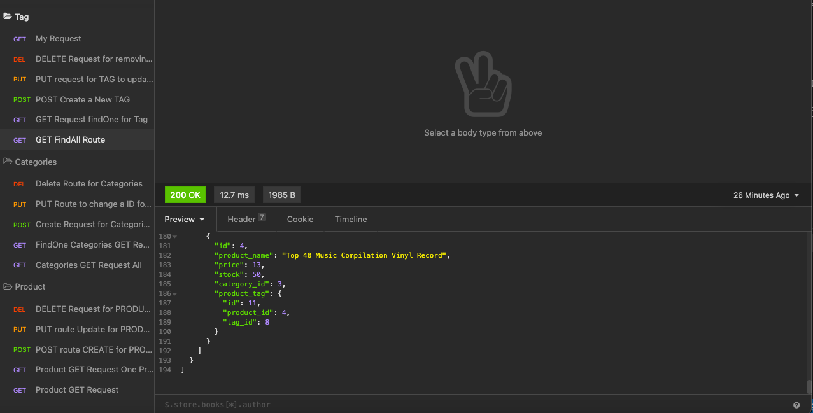

# E-Commerce Database
  
  ## Description
  The Code Repository("E-commerce") intent is to have a E-commerce database, that allows you to add new Product, Categories and Tags to the Ecommerce database. With the use of POST, DELETE and GET routes. In this project , MySQL was used, and with the use of MySQL, the use of seequelize is used to connect to the database. The project also has a few seed files for the categories tested with the get routes. Which are seeded with npm run seed command. The routes, were also tested with Insomnia and all are functional. 
   ## Table of Contents 
  [Installations](#Installations)
  
  [Usage](#Usage)
  
  [Contributors](#Contributors)
  
  [License](#License)
  
  [Tests](#Tests)
  
  [Questions](#Questions)
  ## Installations
  NPM was used in this project and it was installed  by running npm install, and sequelize was install with running the comman npm sequelize, MYSQL was previously installed through the MYSQL website to the computer and can be run with command mysql -u root -p and using the password that was setup when installing
   ## Usage
  This project can be used for an E-commerce ocmpany
   ## Contribution
  You may contribute to this project by reaching out via Github or by emailing kamm8899@gmail.com
  ## Tests
  In order to test this project you will need to download Insomnia Core and run the routes through Insomnia
  ## Demonstration
  [The video can be viewed through clicking on this link:](https://www.youtube.com/watch?v=rjTcxGgzPio)
   
  ## Questions
  For any questions, please reach out to me at: 
  Github: [kamm8899](https://github.com/kamm8899/README-Generator)  
  Email: [kamm8899@gmail.com](mailto:kamm8899@gmail.com)
  # License 
  This repo is using: [ISC](https://opensource.org/licenses/ISC)
